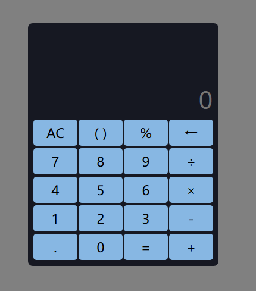

> # 工具介紹
計算機參考手機裡的計算機，因為是想練習javascript所以開始嘗試寫一些小工具當練習，計算機功能待增加

> # 預覽畫面

> # 計算機設計方式

1. 排版
    - 首先根據需求切分成三個區域
        - 計算結果 (最上方)
        - 輸入框 (中間，預設顯示0)
        - 按鈕區域 (最下方)
            - 按鈕在以欄為單位，在區域內橫向排列
            - 欄內元素以flex布局，進行直向排列、置中
            - 每欄之間透過 `justify-content: space-around`平均分配間隔

2. UI設計
    - 深色背景配淺色按鈕來凸顯按鈕的位置
    - 當滑鼠徘徊時會顯示邊框，增加觸碰到按鈕的回饋感
    - 按鈕預設一個透明色的邊框，當滑鼠徘徊時僅更改顏色，而不會因為加了邊框而影響按鈕高度，藉此避免跑板問題
    - 輸入框除了輸入值之外還能同時看見輸入過程，方便檢查計算過程
3. 功能實現
    - 添加監聽器，監聽滑鼠點擊按鈕時，按鈕的text屬性，來決定觸發哪個function
        - 點擊 數字、小數點時，觸發`addCharacter()`紀錄輸入的值
        - 點擊 AC 時，觸發`clearInput()`清除記錄
        - 點擊 倒退鍵時(←)，觸發`deleteLastCharacter()`刪除最後輸入的字符
        - 點擊 等號時，觸發`calculate()`計算結果
